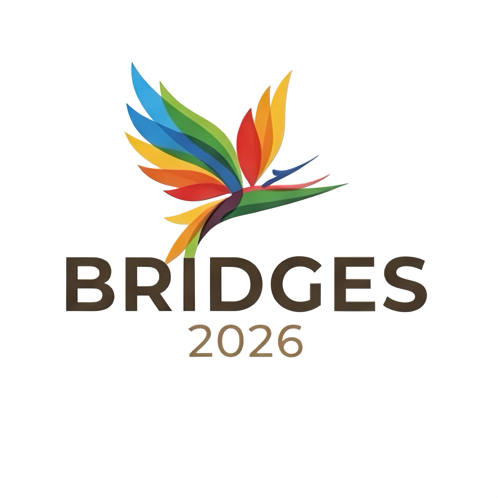

---
# Summer School in The South Pacific.  
**Bridging the Divides with Globally Engineered Software**  
*January 9th – 11th, 2026*

The Summer School is designed to provide participants with practical software solutions in a unique region of the world, while advancing the goal of making software engineering universal—accessible to anyone, anywhere, without technical, cultural, or educational barriers.

Previous editions:
- [BRIDGES 2023](https://naist-se.github.io/PNG-BRIDGES)
- [BRIDGES 2019](https://naist-se.github.io/BRIDGES2019)

With the rise of AI technologies in Software Engineering (SE), this school demonstrates how communities like Papua New Guinea can use these tools to foster equality and democratic participation within their local software ecosystems. For the global SE community, such diverse contexts reveal innovative methods for developing solutions and contributing meaningfully to the open-source (OSS) world.

The 3-day program is taught in *English* and will be held at *Loloata Island Resort*, Port Moresby, Papua New Guinea.  
Participants will receive a *certificate of attendance*.

<section id="venue">
  <h2>Venue</h2>
  
  

    BRIDGES2026 will take place at 
    <a href="https://www.loloataislandresort.com/" target="_blank" rel="noopener noreferrer">
      Loloata Island Resort
    </a>, which is located on an island off the coast of Port Moresby, the capital of the Pacific nation 
    Papua New Guinea (PNG).
  

  

    Known as the <em>land of the unexpected</em>, PNG is home to over 850 languages and a diverse culture, 
    flora, and fauna. Highlights include the iconic <strong>Bird of Paradise</strong> and the world's largest 
    butterfly, the <strong>Queen Alexandra Birdwing</strong>, making PNG one of the last untouched locations 
    on the planet.
  

</section>

---

## Overview of Program
*January 10 - Loloata: Conference Room.*

Session | Details
-------------- | -------------
8:30 - 9:00 | Registration
-------------- | ---------------
9:00 - 9:30 | Welcome
Welcome Address | Professor Ora Renagi OL  (PNGUoT Vice-Chancellor))
Theme and Opening for BRIDGES2026 | Prof. Raula Gaikovina Kula
------------ | -------------
10:00 - 10:30 | Break (Group Photo)
------------ | -------------
10:30 - 12:30 | Keynotes
Keynote Talk 1 | Prof. Kelly Blincoe
Keynote Talk 2 | Prof. Foutse Khomh 
------------ | -------------
12:30 - 13:30 | LUNCH (e-Posters)
------------ | -------------
13:30 - 15:00 | Session 1: Introduction to Git and GitHub
------------ | -------------
.. |  Breakout into Teams (6 person)
.. |  Individual Tasks on Git and GitHub (Prof. Youmei and Lecturer Sankwi )
------------ | -------------
15:00 - 15:30 | Break 
------------ | -------------
15:30 - 16:30 | Session 2: Creating Projects and Contributions
------------ | -------------
.. |  Tasks on first contributions and discussions (Prof. Youmei and Lecturer Sankwi )
.. |  Day 1 - Wrap-up and tasks for Day 2. 
------------ | -------------
night session (8:00pm - 10.00pm) | dinner and closed discussions with invited guests

*January 11 - Loloata: Conference Room.*

Session | Details
-------------- | -------------
9:00 - 10:00  | Day 2 Keynotes
Keynote Talk 3 | Prof. Marc Cheong
.. |  Feedback from Day 1 - 6 teams. 
------------ | -------------
10:00 - 10:30 | Break 
------------ | -------------
10:30 - 12:30 | Session 3: Introduction to GenAI as a Companion.
.. |  Introduction to Using GenAI, LLMs and Agents  (Prof. Kula)
------------ | -------------
12:30 - 13:30 | LUNCH 
------------ | -------------
13:30 - 15:00 | Session 4: Challenge (Creating a Website on GitHub with AI)
------------ | -------------
.. |  Team breakout (Prof. Youmei and Lecturer Sankwi )
------------ | -------------
15:00 - 15:30 | Break 
------------ | -------------
15:30 - 16:30 | Session 5: Continue Challenge 
------------ | -------------
.. |  Team breakout (Prof. Youmei and Lecturer Sankwi )
------------ | -------------
night session (20:00pm - 22.00pm) | dinner and closed discussions with invited guests

*January 12- Loloata - Resort Area*

Session | Details
-------------- | -------------
9:00 - 10:00  | Session 6: Presentations, Feedback
.. |  Team 1 -3  presentations and voting (15 mins each)
------------ | -------------
10:00 - 10:30 | Break 
------------ | -------------
10:30 - 12:30 | Session 7: Presentations, Feedback and Awards
.. |  Team 4 - 6  presentations and voting (15 mins each)
.. |  Awards presentation
.. |  Closing & Future Discussions
------------ | -------------
12:30 - 13:30 | LUNCH
------------ | -------------
closed session (14:00pm - 17:00pm) | future plan discussions with invited guests

- **Research**: Gain early feedback on your research from experts. presentation skills, and seek potential collaborators.
- **Education**: Learn about the latest trends in Software such as the impact of generative Artificial Intelligence and augmented computing and visualization.
- **Promotion of Young Researchers**: Contribute to nurturing the next generation of world-class Young Researchers in the early stages of their careers. 

<html>
<head>
  <title>BRIDGES Speaker Abstracts</title>
</head>
<body>
  <h1>BRIDGES Speaker Abstracts</h1>
  
 
  <h2>Associate Professor Kelly Blincoe</h2>
  <h3>Finding Your Fit: How Your Thinking Style Shapes Your Software Engineering Experience</h3>
  

    Have you ever felt like software just doesn't "click" with the way you think? Recent research shows this isn't just in your head—some software actually works better for certain thinking styles than others. This is also true for the software tools that software engineers use to build and maintain software. I'll share our studies on two widely-used tools: the PyCharm debugger (which helps find and fix bugs) and GitHub Copilot (an AI coding assistant). You'll learn about the inclusivity issues we found and, more importantly, discover practical strategies for working with these tools effectively, regardless of your natural thinking style. I'll also help you identify your own cognitive preferences so you can choose approaches that work best for you as you begin your software engineering journey.
  

  <h2>Associate Professor MarK Cheong</h2>

  
  <h3>Responsible Use of Generative AI and Open Source Tools for Good</h3>
  

    Following from previous BRIDGES events, researchers have identified that building software with open source tools (and possibly generative AI) could empower young people and uplift them with career-building skills. Generative AI products, from ChatGPT to Claude Code, have the potential to improve productivity, and more importantly, become a resource for learning about software development.
  

  

    However, AI—against the broader tech ecosystem—has been known to cause issues such as: perpetuating 'AI slop' and misinformation; exhibiting social biases or amplifying them; causing unwanted harms and side effects; violating privacy and potentially misusing others' work! This, combined with the proprietary nature of many extant software products, might raise some ethical questions on what it means to use them 'responsibly' and 'for good'.
  

  

    In this talk, I will provide a primer of four key ethical principles in the area of AI ethics, and explain their applicability in our use of technology (including AI), as well as what they mean for developers, users, and other stakeholders.
  

  

    Then, I will discuss the benefits found in initiatives such as the open source movement and others in promoting accessibility, fairness, and equality of opportunity. Finally, some practical tips will be offered to participants on how they can begin their journey as software developers in a responsible and ethical manner, by learning from the various issues surrounding contemporary technology, and adopting responsible usage/development practices.
  

</body>
</html>

---

##  Tuition Fee

| Category        | Fee (PGK) | Deadline               |
|----------------|-----------|------------------------|
| Students        | Free (30 spaces) | —                      |
| Early Bird      | 400 PGK   | Register before Dec 1  |
| Regular         | 600 PGK   | Register after Dec 1   |

**Included**:  
- All classes and course materials  
- Lunches and coffee breaks  
- Social dinner  

**Not Included**:  
- Flights  
- Transportation  
- Accommodation  

---

##  Call For International Participants (Deadline November 14th, 2025)

The BRIDGES Summer school will also accept international participants that would also request to mentor students or provide feedback.
To apply, please send an email to bridges.png@gmail.com and motivation for participation (500 words max).  

If your application is accepted, you’ll receive instructions on how to proceed on payment.
you will receive the notification on a email basis as the committee will discuss acceptance.

---

##  Call For Participants Process (Deadline November 14th, 2025)

To apply for the summer school, please send an email to bridges.png@gmail.com a cover letter with your motivation and background details (500 words max), as well as your resume CV.  

We accept registrations as teams or individuals. Please note that we have limited spaces, so please register as soon as you can. Also, spaces is determined by the location. University students will have free registration (subsidized upon registration).

Alternatively, you can either fill out this participants registration application form. [Registration form](https://forms.gle/H528RjKw6mYcPbP7A)

If your application is accepted, you’ll receive instructions on how to proceed with the registraion payment after November 14th.

<!-- BRIDGES Summer School Registration Notice -->

  Registration Closed – BRIDGES Summer School 2026

  Applications for the BRIDGES Summer School 2026 are now closed as of <strong>November 14, 2025</strong>. 
  Thank you to everyone who applied.

---

**Confirmed Keynote Lecturers**
- Prof. Foutse Khomh
- Prof. Kelly Blincoe
- Prof. Marc Choeng

---

#  Meet the Team

**Organizing Team**
- Prof. Raula Gaikovina Kula (The University of Osaka)
- Prof. Youmei Fan (Nara Institute of Science and Technology)
- Dr. Benson Mirou (Papua New Guinea University of Technology)
- Winifred Kula (Bank of South Pacific)

---

#  Contact

For more information, email: `bridges.png@gmail.com`
