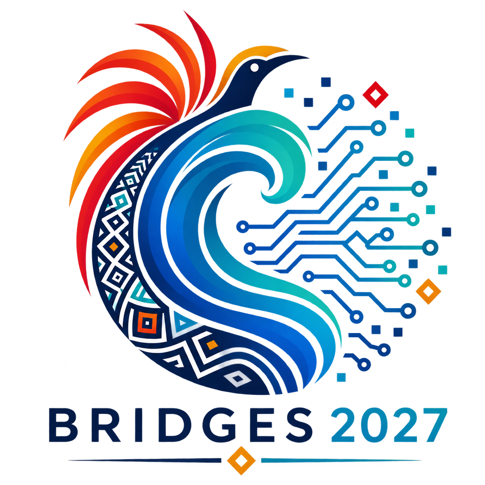

---
---

  <nav class="simple-nav" aria-label="Website sections">
    
    <a href="#about">About</a>
    <a href="#highlights">Highlights</a>
    <a href="#venue">Venue</a>
    <a href="#program">Program</a>
    <a href="#speakers">Speakers</a>
    <a href="#fees">Fees</a>
    <a href="#participants">Apply</a>
    <a href="#team">Team</a>
    <a href="#past-editions">Past Editions</a>
  </nav>

  <header class="masthead" id="workshop-logo">
    

      

        
BRIDGES 2027 · Summer School in the South Pacific

        <h1>Bridging the Divides with Globally Engineered Software</h1>
        <h2>Papua New Guinea and Pacific communities exploring software engineering, AI, open source, and emerging technologies.</h2>
        

          January 9th - 11th, 2027
          Loloata Island Resort
          Registration coming soon
        

      

      

        

          
        

      

    

  </header>

  <section id="about">
    
Purpose

    <h2>About BRIDGES 2027</h2>
    

    

      BRIDGES 2027 continues the mission of making software engineering more accessible,
      inclusive, and globally connected in Papua New Guinea and the wider Pacific. The summer
      school will bring participants together to explore practical software solutions, responsible AI,
      open-source collaboration, and emerging technologies.
    

    

      Under the theme “<strong>Building a Digital App Ecosystem with Agentic AI Technologies</strong>,”
      participants will develop and showcase AI-enabled applications, prototypes, and ideas through an
      open digital hub. The initiative aims to encourage collaboration and local innovation while respecting
      Papua New Guinea’s cultures, languages, regulations, data sovereignty, and social contexts.
    

    

      BRIDGES 2027 will also connect local talent with wider technical and professional communities,
      helping make Papua New Guinean innovation more visible nationally and internationally.
    

  </section>

  <section id="highlights">
    
What to expect

    <h2>Event Highlights</h2>
    

    

      

        

          <svg viewBox="0 0 24 24"><path d="M4 19.5V5a2 2 0 0 1 2-2h12v16H6a2 2 0 0 0-2 2z"></path><path d="M8 7h6M8 11h8"></path></svg>
        

        <strong>Hands-on Learning</strong>
        
Practical workshops and tutorials in software engineering, AI, open source, and emerging technologies.

      

      

        

          <svg viewBox="0 0 24 24"><path d="M7 8h10M7 12h6"></path><rect x="4" y="4" width="16" height="12" rx="2"></rect><path d="M9 20h6M12 16v4"></path></svg>
        

        <strong>Team Projects</strong>
        
Collaborate to design and build AI-enabled applications, prototypes, and solutions.

      

      

        

          <svg viewBox="0 0 24 24"><path d="M12 3l2.2 4.5L19 8.2l-3.5 3.4.8 4.8L12 14.1l-4.3 2.3.8-4.8L5 8.2l4.8-.7z"></path><path d="M8 21h8"></path></svg>
        

        <strong>Keynote &amp; Expert Talks</strong>
        
Learn from researchers and experts in software engineering, AI, and emerging technologies.

      

      

        

          <svg viewBox="0 0 24 24"><circle cx="12" cy="12" r="8"></circle><path d="M4 12h16M12 4c2 2.2 3 4.9 3 8s-1 5.8-3 8M12 4c-2 2.2-3 4.9-3 8s1 5.8 3 8"></path></svg>
        

        <strong>Pacific-Centered Innovation</strong>
        
Explore technology that responds to local needs and the social and cultural contexts of Papua New Guinea and the Pacific.

      

    

  </section>

  <section id="venue">
    
Location

    <h2>Venue</h2>
    

    
Proposed Venue: <a href="https://www.loloataislandresort.com/">Loloata Island Resort</a>

    
📍 Port Moresby, Central Province, Papua New Guinea

    

      BRIDGES 2027 is tentatively planned to take place at Loloata Island Resort, located on an island
      just outside Port Moresby, the capital of Papua New Guinea. Known as the Land of the Unexpected,
      Papua New Guinea is home to more than 850 languages, rich cultural traditions, and remarkable
      biodiversity, including the iconic Bird of Paradise and Queen Alexandra’s Birdwing.
    

    
Venue confirmation and further information on transportation, accommodation, and travel arrangements will be announced soon.

  </section>

  <section id="program">
    
Schedule

    <h2>Overview of Program</h2>
    

    
Detailed 2027 schedule coming soon. Draft structure below.

    

      <h3>Day 1 — Welcome and Foundations</h3>
      <table>
        <tr><th>Session</th><th>Details</th></tr>
        <tr><td>Morning</td><td>Registration, welcome, and opening remarks</td></tr>
        <tr><td>Midday</td><td>Keynote talks and introductions</td></tr>
        <tr><td>Afternoon</td><td>Git, GitHub, software tools, and AI-assisted development</td></tr>
      </table>
    

    

      <h3>Day 2 — Learning and Building</h3>
      <table>
        <tr><th>Session</th><th>Details</th></tr>
        <tr><td>Morning</td><td>Technical sessions and tutorials</td></tr>
        <tr><td>Midday</td><td>Team challenge or hackathon work</td></tr>
        <tr><td>Afternoon</td><td>Mentoring, prototyping, and group feedback</td></tr>
      </table>
    

    

      <h3>Day 3 — Presentations and Future Directions</h3>
      <table>
        <tr><th>Session</th><th>Details</th></tr>
        <tr><td>Morning</td><td>Team presentations and live feedback</td></tr>
        <tr><td>Midday</td><td>Awards, certificates, and closing remarks</td></tr>
        <tr><td>Afternoon</td><td>Future planning discussions</td></tr>
      </table>
    

  </section>

  <section id="speakers">
    
People

    <h2>Speakers</h2>
    

    

      

        
        
Keynote Speaker

        <strong>Prof. David Lo</strong>
        
<em>Vice Provost (Research) &amp; OUB Chair Professor of Computer Science</em> 
        <strong>Singapore Management University</strong>

        
Professor David Lo is a leading researcher in software engineering and artificial intelligence. His research explores intelligent software engineering, AI-assisted software development, software analytics, and trustworthy software and AI systems. He is also Co-Director of SMU's Centre for Research for Intelligent Software Engineering (RISE).

        
<strong>Keynote Title:</strong> To be announced.

      

    

    
Additional speakers will be announced soon.

  </section>

  <section id="fees">
    
Registration

    <h2>Tuition Fee</h2>
    

    
2027 fee structure and deadlines to be announced.

    <table>
      <tr><th>Category</th><th>Fee</th><th>Deadline</th></tr>
      <tr><td>Students</td><td>To be announced</td><td>To be announced</td></tr>
      <tr><td>Early Bird</td><td>To be announced</td><td>To be announced</td></tr>
      <tr><td>Regular</td><td>To be announced</td><td>To be announced</td></tr>
    </table>
  </section>

  <section id="participants">
    
Join us

    <h2>Call for Participants</h2>
    

    

      <h3>Who can participate?</h3>
      

        BRIDGES 2027 welcomes students, researchers, practitioners, and mentors interested in software
        engineering, AI, emerging technologies, and Pacific-centered innovation. The summer school aims
        to bring together participants from Papua New Guinea, the wider Pacific, and the international
        community to learn, collaborate, and exchange ideas.
      

      

        
Registration

        
Coming soon

        
Application details, participant requirements, and deadlines will be announced here.

      

    

  </section>

  <section id="team">
    
Organizers

    <h2>Meet the Team</h2>
    

    
BRIDGES 2027 is made possible through collaboration between organizers, researchers, educators, and partners in Papua New Guinea and the wider international software engineering community.

    
The 2027 organizing team and partner information will be announced soon.

  </section>

  <section id="past-editions">
    
Archive

    <h2>Past Editions</h2>
    

    <ul>
      <li><a href="https://bridges-png.github.io/2026/">BRIDGES 2026</a></li>
      <li><a href="https://naist-se.github.io/PNG-BRIDGES">BRIDGES 2023</a></li>
      <li><a href="https://naist-se.github.io/BRIDGES2019">BRIDGES 2019</a></li>
    </ul>
  </section>

  <section class="footer-contact" id="contact">
    

      

        <h2>Contact</h2>
        

        
<strong>Questions about BRIDGES 2027?</strong>

        
For general enquiries, contact us at <a href="mailto:bridges.png@gmail.com"><strong>bridges.png@gmail.com</strong></a>

      

      
    

    

    

      BRIDGES 2027 · Papua New Guinea
      © 2027 BRIDGES
    

  </section>

