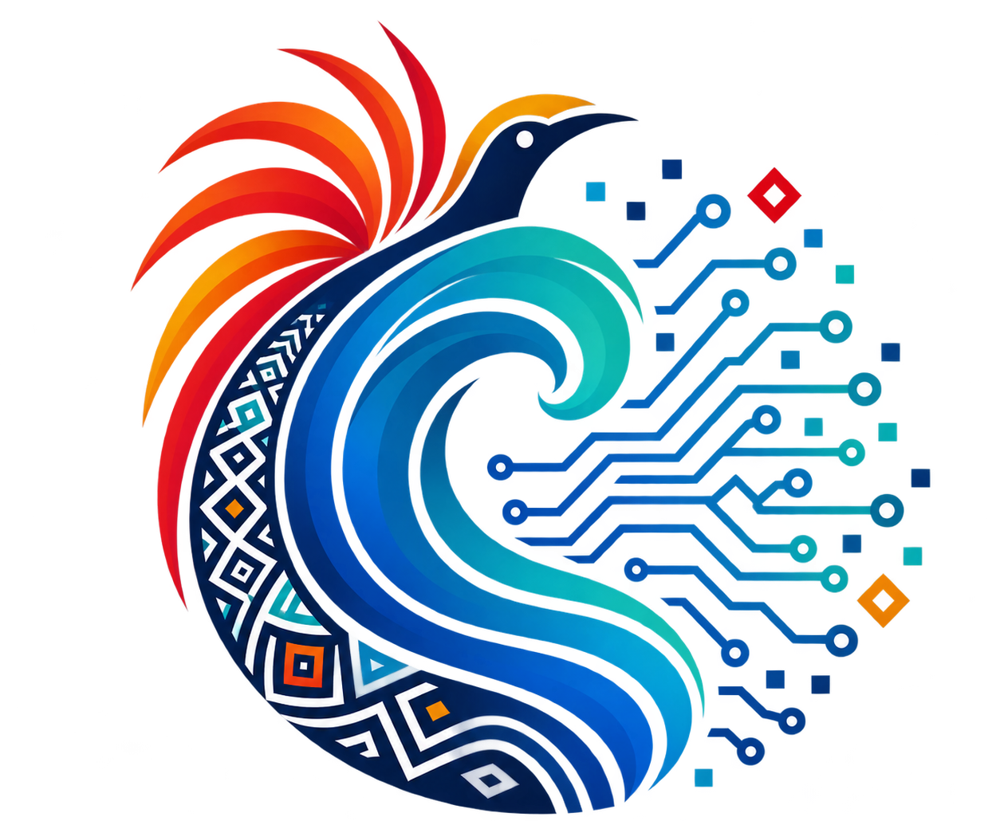

---
---

  <nav class="simple-nav" aria-label="Website sections">
    <a href="#about">About</a>
    <a href="#highlights">Highlights</a>
    <a href="#venue">Venue</a>
    <a href="#program">Program</a>
    <a href="#speakers">Speakers</a>
    <a href="#fees">Fees</a>
    <a href="#participants">Apply</a>
    <a href="#team">Team</a>
    <a href="#past-editions">Past Editions</a>
  </nav>

  <header class="masthead" id="workshop-logo">
    

      

        
BRIDGES 2027 · Summer School in the South Pacific

        <h1>Bridging the Divides with Globally Engineered Software</h1>
        <h2>Papua New Guinea and Pacific communities exploring software engineering, AI, open source, and emerging technologies.</h2>
        

          Dates to be announced
          Venue to be announced
          Registration coming soon
        

      

      

        

          
        

      

    

  </header>

  <section id="about">
    
Purpose

    <h2>About BRIDGES 2027</h2>
    

    

      BRIDGES 2027 will continue the mission of making software engineering more accessible, inclusive,
      and globally connected. The summer school will focus on practical software solutions, responsible AI,
      open-source collaboration, and emerging technologies in the context of Papua New Guinea and the wider Pacific region.
    

    
Final 2027 theme and description coming soon.

  </section>

  <section id="highlights">
    
What to expect

    <h2>Event Highlights</h2>
    

    

      
<strong>Research</strong>
Gain feedback on ideas and connect with researchers and mentors.

      
<strong>Education</strong>
Learn practical skills in software engineering, AI tools, GitHub, and open source.

      
<strong>Community</strong>
Build connections between Pacific communities and global software engineering networks.

      
<strong>Hackathon</strong>
Team challenge details coming soon.

      
<strong>Keynotes</strong>
Speaker lineup coming soon.

      
<strong>Certificates</strong>
Participants will receive a certificate of attendance.

    

  </section>

  <section id="venue">
    
Location

    <h2>Venue</h2>
    

    
2027 venue to be announced.

    
This section will include venue description, transport schedule, accommodation guidance, and travel information.

  </section>

  <section id="program">
    
Schedule

    <h2>Overview of Program</h2>
    

    
Detailed 2027 schedule coming soon. Draft structure below.

    

      <h3>Day 1 — Welcome and Foundations</h3>
      <table>
        <tr><th>Session</th><th>Details</th></tr>
        <tr><td>Morning</td><td>Registration, welcome, and opening remarks</td></tr>
        <tr><td>Midday</td><td>Keynote talks and introductions</td></tr>
        <tr><td>Afternoon</td><td>Git, GitHub, software tools, and AI-assisted development</td></tr>
      </table>
    

    

      <h3>Day 2 — Learning and Building</h3>
      <table>
        <tr><th>Session</th><th>Details</th></tr>
        <tr><td>Morning</td><td>Technical sessions and tutorials</td></tr>
        <tr><td>Midday</td><td>Team challenge or hackathon work</td></tr>
        <tr><td>Afternoon</td><td>Mentoring, prototyping, and group feedback</td></tr>
      </table>
    

    

      <h3>Day 3 — Presentations and Future Directions</h3>
      <table>
        <tr><th>Session</th><th>Details</th></tr>
        <tr><td>Morning</td><td>Team presentations and live feedback</td></tr>
        <tr><td>Midday</td><td>Awards, certificates, and closing remarks</td></tr>
        <tr><td>Afternoon</td><td>Future planning discussions</td></tr>
      </table>
    

  </section>

  <section id="speakers">
    
People

    <h2>Speakers and Abstracts</h2>
    

    
Speaker names, photos, biographies, talk titles, abstracts, and slides will be added here.

    

      
<strong>Speaker 1</strong>
To be announced.

      
<strong>Speaker 2</strong>
To be announced.

      
<strong>Speaker 3</strong>
To be announced.

      
<strong>Speaker 4</strong>
To be announced.

    

  </section>

  <section id="fees">
    
Registration

    <h2>Tuition Fee</h2>
    

    
2027 fee structure and deadlines to be announced.

    <table>
      <tr><th>Category</th><th>Fee</th><th>Deadline</th></tr>
      <tr><td>Students</td><td>To be announced</td><td>To be announced</td></tr>
      <tr><td>Early Bird</td><td>To be announced</td><td>To be announced</td></tr>
      <tr><td>Regular</td><td>To be announced</td><td>To be announced</td></tr>
    </table>
  </section>

  <section id="participants">
    
Join us

    <h2>Call for Participants</h2>
    

    

      

        BRIDGES 2027 will welcome students, researchers, practitioners, mentors, and international participants
        interested in software engineering, AI, emerging technologies, and Pacific-centered innovation.
      

      
Application instructions, deadlines, registration form, and participant requirements coming soon.

    

  </section>

  <section id="team">
    
Organizers

    <h2>Meet the Team</h2>
    

    
2027 organizing team details coming soon.

    <ul>
      <li>Organizer names and affiliations to be added.</li>
      <li>Local partners and supporting institutions to be added.</li>
    </ul>
  </section>

  <section id="past-editions">
    
Archive

    <h2>Past Editions</h2>
    

    <ul>
      <li><a href="./2026/">BRIDGES 2026</a></li>
      <li><a href="https://naist-se.github.io/PNG-BRIDGES">BRIDGES 2023</a></li>
      <li><a href="https://naist-se.github.io/BRIDGES2019">BRIDGES 2019</a></li>
    </ul>
  </section>

  <section class="footer-contact" id="contact">
    <h2>Contact</h2>
    
For more information, email: <strong>bridges.png@gmail.com</strong>

  </section>

